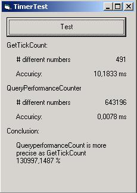



## Nick of time

### Description

Take control over time, howto get a better frequency than 1 millisecond.
 
### More Info
 

             |
---                |---
**Submitted On**   |2001-04-13 16:31:38
**By**             |[Networking\.be](https://github.com/Planet-Source-Code/PSCIndex/blob/master/ByAuthor/networking-be.md)
**Level**          |Advanced
**User Rating**    |4.6 (32 globes from 7 users)
**Compatibility**  |VB 5\.0, VB 6\.0
**Category**       |[Windows API Call/ Explanation](https://github.com/Planet-Source-Code/PSCIndex/blob/master/ByCategory/windows-api-call-explanation__1-39.md)
**World**          |[Visual Basic](https://github.com/Planet-Source-Code/PSCIndex/blob/master/ByWorld/visual-basic.md)
**Archive File**   |[Nick of ti183184132001\.zip](https://github.com/Planet-Source-Code/networking-be-nick-of-time__1-22378/archive/master.zip)

### Source Code

If you think that the most accurate interval you can get is 1 ms, think again.
 This article shows you how you can wait a very short time.

How short, well, on my PC (500mHz,128MB) i got an average of 0.0078 ms!
 The trick is to make use of a high frequency performance counter wich nowaday
almost all computers have.

To do this, you must make use of the QueryPerformanceCount API (QPC). This give you a number.
 This number is the current count of the timer. When you use the QueryPerformanceFrequency (QPF) API, you will get the number of times that the timer counts per second.
 Using that value, you can determin how much time has expired.

Example: if your frequency = 1.000.000 and the difference between 2 calls of the QPC is 1.000, you know that the time elapsed is 1.000 / 1.000.000 = 0.001 seconds.

The example included (see zip) also show that the GetTickCount API isn't as fast as you may think. I got a accuricy of +/- 10 ms

After this, you will never want to use gettickcount again

